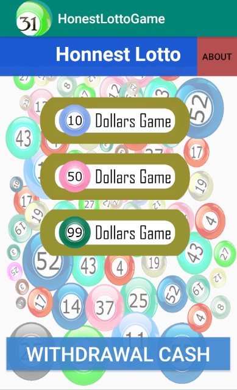
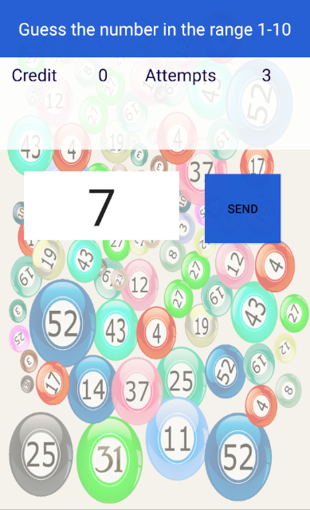
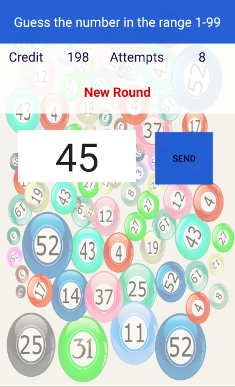

# HonnestLottoGame
The simple Android game of guessing the number which has been chosen secretly.\
A user has several attempts to guess the number that has been previously chosen by the system from predefined range on numbers.\
Every time the user fails to guess the number, the game gives him a hint of whether the chosen number is bigger or 
smaller than the provided answer.\
Every successful attempt brings the user credits and resets the number of guessing attempts available.\
The game has three modes which are different in the number of attempts and range of numbers to guess. 

## Platform
Android MinSDK 22(Android Lollipop v5.1)

## Language
Java

## Screenshots

### Main Screen

### 10 dollars game

### 99 dollars game

